# Dobot CR3 机械臂项目

**基于 Dobot CR3 + Lebai LMG-90 的真机 Vision-Language-Action 与部署**

`LeRobot` `ACT` `SmolVLA` `π0 / OpenPI` `MuJoCo` `真实机械臂`

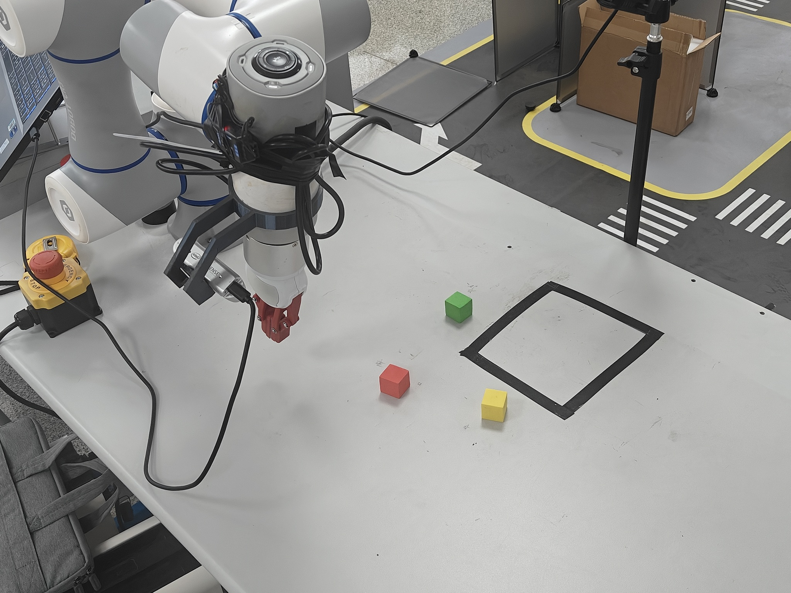

本仓库在 [LeRobot](https://github.com/huggingface/lerobot) 基础上扩展了 Dobot CR3 真机研究工作流，覆盖 leader-follower 遥操作、双相机示教、LeRobotDataset 转换、轨迹清洗、VLA 策略实验、MuJoCo 工具链与 π0 远程部署。

## 项目概览

```text
Leader-Follower 遥操作
          ↓
双相机示教 + 机器人状态 + 任务文本
          ↓
原始 CR3 episode → 审核 / 筛选 / 分割
          ↓
LeRobotDataset v3.0 + 事件聚焦数据集
          ↓
ACT / SmolVLA / π0 实验
          ↓
MuJoCo 回放 / 离线评估 / 真机部署
          ↓
失败分析 → 数据与训练迭代
```

## 硬件配置

| 组件 | 已确认的实现细节 |
| --- | --- |
| 机械臂 | Dobot CR3，通过 Dashboard 和 Move TCP API 控制 |
| 夹爪 | Lebai LMG-90；包含硬件命令路径与 MuJoCo 模型 |
| 前视相机 | OpenCV 兼容的前视 RGB 采集路径 |
| 腕部相机 | Intel RealSense 彩色流；采集器可选处理深度图 |
| 遥操作 | Leader-follower CR3 控制器，包含初始对齐、平滑、关节限位与 ServoJ 执行 |
| 计算接口 | 本地策略客户端通过 TCP 与远程 π0 服务端通信 |

## 数据采集与清洗

### 示教格式

采集器 [`scripts/collection/record_drag_dataset.py`](scripts/collection/record_drag_dataset.py) 以帧为单位记录前视/腕视 RGB 观测、follower 状态与目标动作、夹爪命令或状态、时间戳、帧序号、任务文本及按 eπsode 组织的原始数据。

[`scripts/datasets/convert_drag_to_lerobot.py`](scripts/datasets/convert_drag_to_lerobot.py) 会把原始采集数据转换为本地 LeRobot v3.0 数据集。当前清洗后的 π0 数据集使用以下动作结构。

| 字段 | 取值 |
| --- | --- |
| 数据集格式 | LeRobot `v3.0` |
| 相机 | 2 个：`observation.images.front_rgb`、`observation.images.wrist_rgb` |
| FPS | 30 |
| 动作 | `float32[7] = [q1, q2, q3, q4, q5, q6, gripper]` |
| 夹爪训练动作 | `close_high`：`0 = 打开`、`1 = 闭合` |

### 本地清洗数据集族

训练前通过“筛选、Qwen 辅助审核和分割”会将完整轨迹与事件聚焦片段拆分为不同数据集，再由混合采样器按比例抽样。

| 数据集 | Episodes | Frames | 用途 |
| --- | ---: | ---: | --- |
| `v1_complete_goal` | 718 | 660,874 | 完整的语言条件轨迹 |
| `v1_goal_grasp_event` | 763 | 243,573 | 宽抓取上下文片段 |
| `v1_goal_place_event` | 763 | 212,091 | 宽放置上下文片段 |
| `v1_atomic_assist` | 1,892 | 340,951 | 原子阶段辅助片段 |
| `v2_grasp_lift_event` | 736 | 98,773 | 抓取并抬起事件片段 |
| `v2_release_event` | 759 | 57,924 | 释放事件片段 |
| `v3_grasp_transition_event` | 760 | 187,263 | 打开 / 下探 / 闭合 / 抬起转换片段 |

审核、筛选、分割和数据清单构建工具位于 [`scripts/data_processing/`](scripts/data_processing/) 与 [`scripts/datasets/`](scripts/datasets/)。已转换的 LeRobot 数据集不保存逐帧 `phase` 字段，因此可视化不会伪造阶段标签。

### 四类示教任务

| 红色物块 | 绿色物块 |
| --- | --- |
| 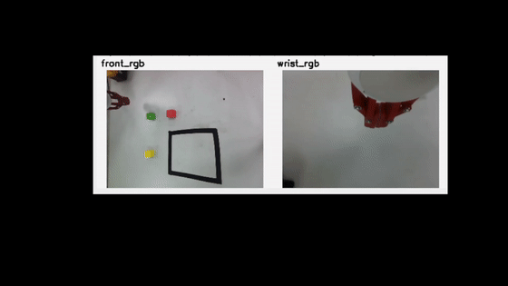 | 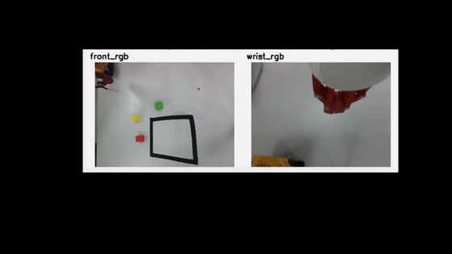 |

| 黄色物块 | 三物块完整任务 |
| --- | --- |
| 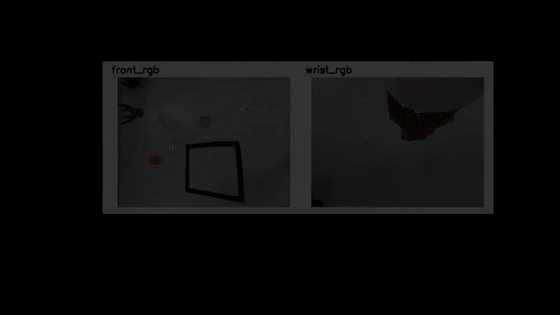 | 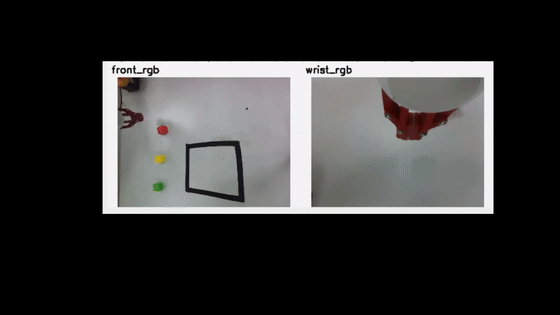 |

### 示例：真实示教动作

下图来自 `cr3_pi0_unified_goal_v1_complete_goal` 的真实 episode（`episode_index=12`）。图中绘制的是已保存的动作标签。
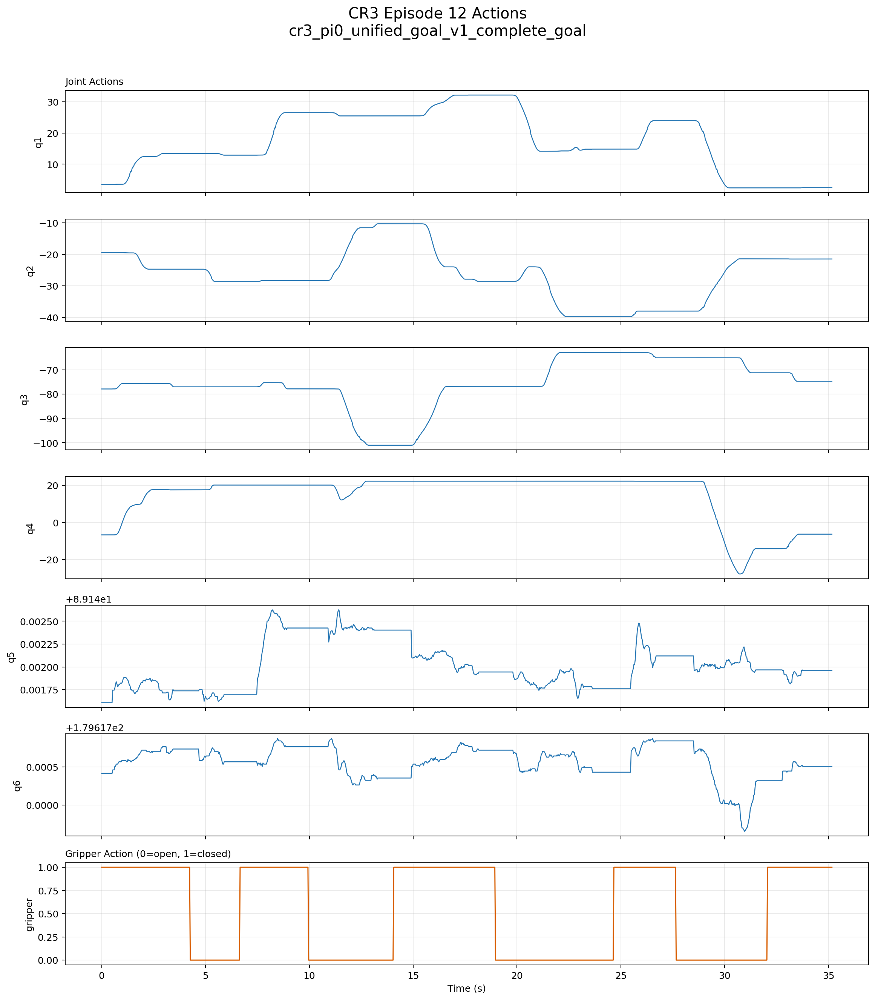


## 策略训练


| 策略 | 已确认的项目集成 | 本仓库实验状态 |
| --- | --- | --- |
| ACT | LeRobot ACT 策略、CR3 本地训练辅助脚本和真机推理客户端 | 已存在训练与推理入口；尚未在此作为 CR3 benchmark 发布 checkpoint 或结果元数据 |
| SmolVLA | LeRobot SmolVLA 策略和 CR3 MuJoCo rollout 脚本 | 已有仿真 rollout 路径；TODO：在宣称前验证可复现的 CR3 微调运行 |
| π0 / OpenPI | π0 策略、固定比例混合训练扩展、远程策略服务端/客户端、checkpoint 控制和回放评估 | 当前主要真机 VLA 实验路径；抓取可靠性仍在排查 |

π0 训练支持全量微调和 LoRA 配置、固定比例数据集混合、任务均衡、梯度累积、定期 checkpoint 及 loss 绘图。

### π0 训练曲线

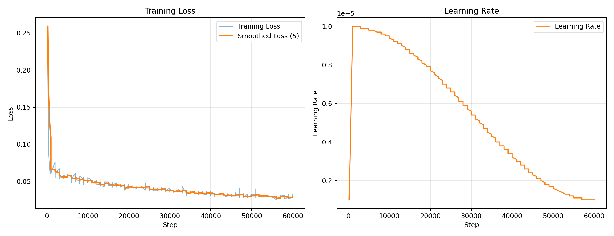


## MuJoCo 仿真

CR3 MuJoCo 工作区 [`sim/cr3_mujoco/`](sim/cr3_mujoco/) 包含 CR3 场景构建、URDF/STL 资源、关节映射、LMG-90 接触/抓取质量检查、末端遥操作、仿真数据采集与回放，以及 rollout 工具。


### CR3 + LMG-90 仿真场景

| 场景一 | 场景二 |
| --- | --- |
| 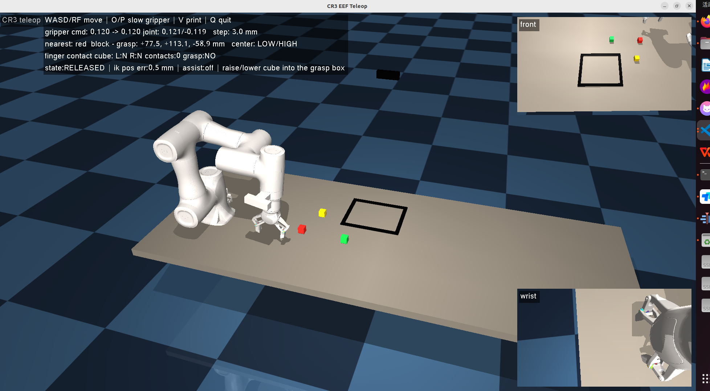 | 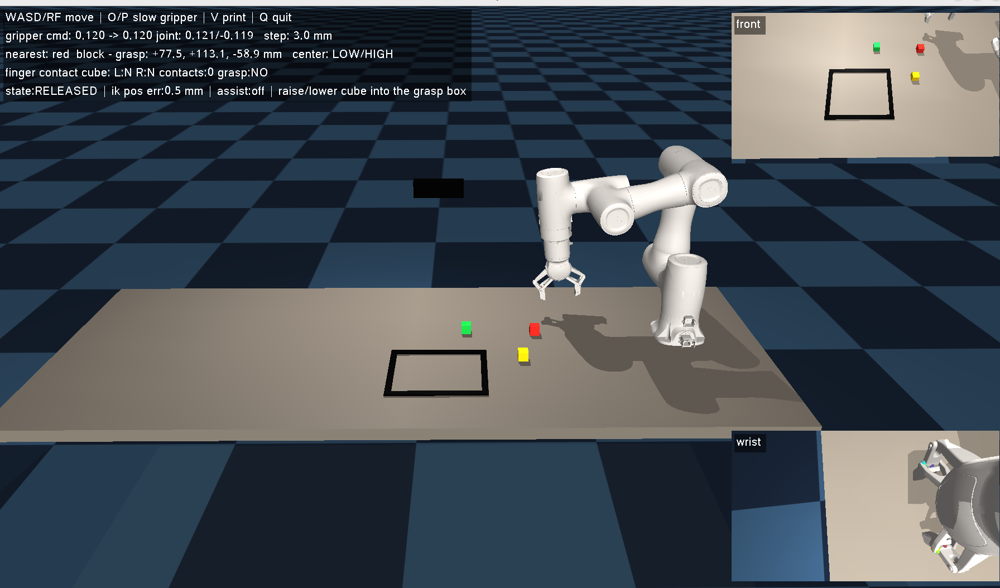 |

## 真机部署

部署路径分为两个进程：

1. [`scripts/inference/run_remote_pi0_policy.py`](scripts/inference/run_remote_pi0_policy.py) 读取相机与 CR3 状态，发送策略 payload，管理动作块，并向机械臂和夹爪发送受限命令。
2. [`scripts/inference/pi0_remote_policy_server.py`](scripts/inference/pi0_remote_policy_server.py) 加载 Pi0 checkpoint 或 LoRA adapter，完成预处理、推理、后处理，并返回动作块。

客户端包含动作队列处理、延迟补偿、单关节增量限制、可选关节锁定、夹爪去抖/保持控制，以及 ServoJ/JointMovJ 命令模式。
### 真机 Rollout 样例

| 红色任务 | 绿色任务 | 黄色任务 |
| --- | --- | --- |
| 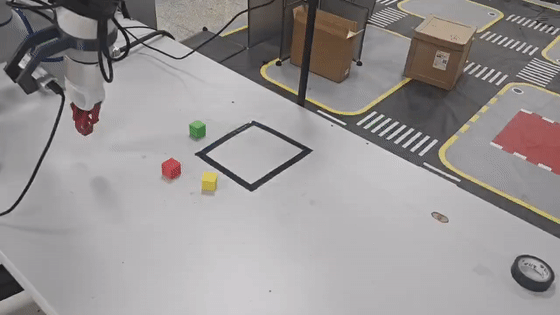 | 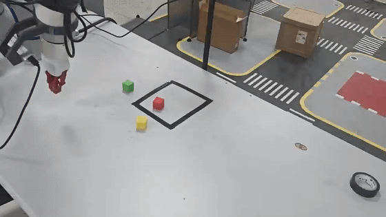 | 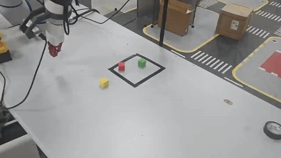 |

## 失败分析与评测

### 当前失效模式

1.固定点位附近表现相对稳定，但物块颜色、初始位置、机械臂初始姿态或遮挡发生变化时，抓取成功率明显波动。
2.随机物体位置末端能够到达物体上方，但下探深度、夹爪打开/闭合时机和抬起动作仍不稳定。
3.长任务会累积误差，前一阶段偏差可能导致后续搬运和放置失败。

## 仓库结构

```text
src/lerobot/robots/dobot_cr3/  CR3 TCP 机器人、夹爪和 leader-follower 集成
scripts/collection/            真机示教采集
scripts/data_processing/       审核、筛选和轨迹分割
scripts/datasets/              数据清单构建与 LeRobot 转换
scripts/training/              训练工具与 loss 绘图
scripts/evaluation/            数据审计与远程策略回放评估
scripts/inference/             ACT/π0 真机推理路径
scripts/diagnostics/           ServoJ 诊断
sim/cr3_mujoco/                CR3 + LMG-90 仿真、回放与 rollout 工具
tools/                         小型可复现分析工具
docs/                          项目地图、工作流、计划与媒体清单
tests/                         上游和 CR3 专项回归测试
```

