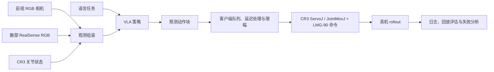

# CR3 视觉-语言-动作操控项目

**基于 Dobot CR3 + Lebai LMG-90 的真机 Vision-Language-Action 学习与部署**

`LeRobot` `ACT` `SmolVLA` `Pi0 / OpenPI` `MuJoCo` `真实机械臂`


本仓库在 [LeRobot](https://github.com/huggingface/lerobot) 基础上扩展了 Dobot CR3 真机研究工作流，覆盖 leader-follower 遥操作、双相机示教、LeRobotDataset 转换、轨迹清洗、VLA 策略实验、MuJoCo 工具链与 Pi0 远程部署。

它既是可复现实验工作区，也是工程项目作品集。当前项目**不宣称**已经稳定实现端到端抓取与放置。

## 当前状态

### 已实现的流程能力

| 模块 | 仓库中的实现证据 |
| --- | --- |
| CR3 通信与控制 | `DobotCR3` Dashboard/Move TCP 集成、ServoJ/JointMovJ 命令与机器人状态读取 |
| LMG-90 夹爪集成 | 真机夹爪控制路径、LMG-90 MuJoCo 模型与抓取检查 |
| 遥操作与采集 | leader-follower 控制器和双相机示教采集器 |
| LeRobot 数据流程 | 原始 CSV/图像转换为 LeRobot v3.0 数据集，包含筛选、Qwen 辅助审核、分割与数据清单 |
| 策略工具 | ACT 推理入口；Pi0 训练扩展、远程策略服务端/客户端与回放评估；SmolVLA 仿真 rollout |
| 仿真 | CR3 + LMG-90 MuJoCo 场景、遥操作、数据回放、质量检查与策略 rollout 工具 |
| 分析 | 数据采样审计、远程策略回放指标、夹爪事件报告、ServoJ 诊断与动作可视化 |

### 任务表现

| 能力 | 基于当前证据的状态 |
| --- | --- |
| 相机到策略再到 CR3 的执行链路 | 已实现，并在真机推理路径中实际使用 |
| 接近目标区域 | 已在探索性真机 rollout 中观察到；此处不报告定量成功率 |
| 稳定抓取、抬起与释放 | 尚未建立；当前仍是故障分析与数据整理重点 |
| 端到端任务成功率 | `TBD`：仓库中尚未提交受控评测表格 |

## 项目概览

```text
Leader-Follower 遥操作
          ↓
双相机示教 + 机器人状态 + 任务文本
          ↓
原始 CR3 episode → 审核 / 筛选 / 分割
          ↓
LeRobotDataset v3.0 + 事件聚焦数据集
          ↓
ACT / SmolVLA / Pi0 实验
          ↓
MuJoCo 回放 / 离线评估 / 真机部署
          ↓
失败分析 → 数据与训练迭代
```

## 系统架构



Pi0 部署路径使用本地客户端读取相机和机器人 I/O，并通过 TCP 策略服务端进行 GPU 推理。当前协议使用受信任的 `pickle` 消息，因此只适用于受信任局域网或 SSH 隧道。

## 硬件配置

| 组件 | 已确认的实现细节 |
| --- | --- |
| 机械臂 | Dobot CR3，通过 Dashboard 和 Move TCP API 控制 |
| 夹爪 | Lebai LMG-90；包含硬件命令路径与 MuJoCo 模型 |
| 前视相机 | OpenCV 兼容的前视 RGB 采集路径 |
| 腕部相机 | Intel RealSense 彩色流；采集器可选处理深度图 |
| 遥操作 | Leader-follower CR3 控制器，包含初始对齐、平滑、关节限位与 ServoJ 执行 |
| 计算接口 | 本地策略客户端通过 TCP 与远程 Pi0 服务端通信 |

具体相机型号、串口、IP 地址和 GPU 主机均依赖实验室环境，因而不会写入可移植的仓库默认配置。

## 数据采集与清洗

### 示教格式

采集器 [`scripts/collection/record_drag_dataset.py`](scripts/collection/record_drag_dataset.py) 以帧为单位记录前视/腕视 RGB 观测、follower 状态与目标动作、夹爪命令或状态、时间戳、帧序号、任务文本及按 episode 组织的原始数据。

[`scripts/datasets/convert_drag_to_lerobot.py`](scripts/datasets/convert_drag_to_lerobot.py) 会把原始采集数据转换为本地 LeRobot v3.0 数据集。当前清洗后的 Pi0 数据集使用以下动作结构。

| 字段 | 已核实的取值 |
| --- | --- |
| 数据集格式 | LeRobot `v3.0` |
| 相机 | 2 个：`observation.images.front_rgb`、`observation.images.wrist_rgb` |
| FPS | 30 |
| 动作 | `float32[7] = [q1, q2, q3, q4, q5, q6, gripper]` |
| 夹爪训练动作 | `close_high`：`0 = 打开`、`1 = 闭合` |

### 本地清洗数据集族

训练前会将完整轨迹与事件聚焦片段拆分为不同数据集，再由混合采样器按比例抽样。

| 数据集 | Episodes | Frames | 用途 |
| --- | ---: | ---: | --- |
| `v1_complete_goal` | 718 | 660,874 | 完整的语言条件轨迹 |
| `v1_goal_grasp_event` | 763 | 243,573 | 宽抓取上下文片段 |
| `v1_goal_place_event` | 763 | 212,091 | 宽放置上下文片段 |
| `v1_atomic_assist` | 1,892 | 340,951 | 原子阶段辅助片段 |
| `v2_grasp_lift_event` | 736 | 98,773 | 抓取并抬起事件片段 |
| `v2_release_event` | 759 | 57,924 | 释放事件片段 |
| `v3_grasp_transition_event` | 760 | 187,263 | 打开 / 下探 / 闭合 / 抬起转换片段 |

审核、筛选、分割和数据清单构建工具位于 [`scripts/data_processing/`](scripts/data_processing/) 与 [`scripts/datasets/`](scripts/datasets/)。已转换的 LeRobot 数据集不保存逐帧 `phase` 字段，因此可视化不会伪造阶段标签。

### 四类示教任务

| 红色物块 | 绿色物块 |
| --- | --- |
|  |  |

| 黄色物块 | 三物块完整任务 |
| --- | --- |
|  |  |

### 示例：真实示教动作

下图来自 `cr3_pi0_unified_goal_v1_complete_goal` 的真实 episode（`episode_index=12`）。图中绘制的是已保存的动作标签，而不是策略 rollout 或平滑后的预测动作。


图由 [`tools/visualize_episode_actions.py`](tools/visualize_episode_actions.py) 生成。脚本会先校验动作结构，再打印动作/夹爪统计；只有读取的数据集真实包含阶段信息时，才会绘制阶段标记。

## 策略训练

仓库包含多条策略路径。下表中的“已集成”只表示对应代码路径存在，并不代表每种策略都有可比较且成功的真机结果。

| 策略 | 已确认的项目集成 | 本仓库实验状态 |
| --- | --- | --- |
| ACT | LeRobot ACT 策略、CR3 本地训练辅助脚本和真机推理客户端 | 已存在训练与推理入口；尚未在此作为 CR3 benchmark 发布 checkpoint 或结果元数据 |
| SmolVLA | LeRobot SmolVLA 策略和 CR3 MuJoCo rollout 脚本 | 已有仿真 rollout 路径；TODO：在宣称前验证可复现的 CR3 微调运行 |
| Pi0 / OpenPI | Pi0 策略、固定比例混合训练扩展、远程策略服务端/客户端、checkpoint 控制和回放评估 | 当前主要真机 VLA 实验路径；抓取可靠性仍在排查 |

Pi0 训练支持全量微调和 LoRA 配置、固定比例数据集混合、任务均衡、梯度累积、定期 checkpoint 及 loss 绘图。训练 loss 仅是优化诊断，**不能**作为真机任务成功的证据。

### Pi0 训练曲线


上图用于观察训练过程是否稳定；模型优劣仍需以独立回放和受控真机试验判断。

## MuJoCo 仿真

CR3 MuJoCo 工作区 [`sim/cr3_mujoco/`](sim/cr3_mujoco/) 包含 CR3 场景构建、URDF/STL 资源、关节映射、LMG-90 接触/抓取质量检查、末端遥操作、仿真数据采集与回放，以及 SmolVLA rollout 工具。

它用于验证映射、接触和回放，不代表已经完成 sim-to-real 迁移。

### CR3 + LMG-90 仿真场景

| 场景一 | 场景二 |
| --- | --- |
|  |  |

## 真机部署

部署路径分为两个进程：

1. [`scripts/inference/run_remote_pi0_policy.py`](scripts/inference/run_remote_pi0_policy.py) 读取相机与 CR3 状态，发送策略 payload，管理动作块，并向机械臂和夹爪发送受限命令。
2. [`scripts/inference/pi0_remote_policy_server.py`](scripts/inference/pi0_remote_policy_server.py) 加载 Pi0 checkpoint 或 LoRA adapter，完成预处理、推理、后处理，并返回动作块。

客户端包含动作队列处理、延迟补偿、单关节增量限制、可选关节锁定、夹爪去抖/保持控制，以及 ServoJ/JointMovJ 命令模式。这些是部署侧安全措施，不能替代策略本身的质量。

### 真机 Rollout 样例

| 红色任务 | 绿色任务 | 黄色任务 |
| --- | --- | --- |
|  |  |  |

这些 GIF 记录的是当前策略的探索性真机执行过程，用于展示部署链路与当前行为，而非宣称固定成功率。

## 失败分析与评测

### 当前失效模式

当前系统可以执行视觉条件下的机械臂运动，并能在探索性 rollout 中接近目标区域，但尚未证明可靠抓取。当前主要研究重点是“接近”到“抓取”的转换：夹爪状态、下探深度、动作归一化/反归一化、机器人命令映射，以及闭环 rollout 中累积的误差。

### 已实现的分析工具

| 分析项 | 对应实现 |
| --- | --- |
| 数据集动作/夹爪检查 | [`tools/visualize_episode_actions.py`](tools/visualize_episode_actions.py) 与上方真实曲线图 |
| 数据集混合审计 | [`scripts/evaluation/audit_pi0_unified_goal_sampling.py`](scripts/evaluation/audit_pi0_unified_goal_sampling.py) |
| 远程策略回放 | [`scripts/evaluation/eval_remote_pi0_replay.py`](scripts/evaluation/eval_remote_pi0_replay.py) |
| 抓取转换对比 | [`scripts/evaluation/review_grasp_transition_comparison.py`](scripts/evaluation/review_grasp_transition_comparison.py) |
| ServoJ 行为诊断 | [`scripts/diagnostics/diagnose_cr3_servoj.py`](scripts/diagnostics/diagnose_cr3_servoj.py) |

### 评测协议

仓库尚未提交可靠的成功率 benchmark。后续真机评测会单独记录以下阶段指标。

| 指标 | 状态 |
| --- | --- |
| 接近目标成功率 | TBD |
| 抓取成功率 | TBD |
| 抬起成功率 | TBD |
| 搬运成功率 | TBD |
| 放置成功率 | TBD |
| 完整任务成功率 | TBD |

## 仓库结构

```text
src/lerobot/robots/dobot_cr3/  CR3 TCP 机器人、夹爪和 leader-follower 集成
scripts/collection/            真机示教采集
scripts/data_processing/       审核、筛选和轨迹分割
scripts/datasets/              数据清单构建与 LeRobot 转换
scripts/training/              训练工具与 loss 绘图
scripts/evaluation/            数据审计与远程策略回放评估
scripts/inference/             ACT/Pi0 真机推理路径
scripts/diagnostics/           ServoJ 诊断
sim/cr3_mujoco/                CR3 + LMG-90 仿真、回放与 rollout 工具
tools/                         小型可复现分析工具
docs/                          项目地图、工作流、计划与媒体清单
tests/                         上游和 CR3 专项回归测试
```

## 可复现入口

使用项目既有工具配置环境：

```bash
uv sync --extra training
```

可视化一个真实数据集 episode：

```bash
uv run python tools/visualize_episode_actions.py \
  --dataset lerobot_data/local/cr3_pi0_unified_goal_v1_complete_goal \
  --episode 12 \
  --gripper-semantics close_high \
  --output outputs/analysis/episode_12_actions.png
```

训练前审计 Pi0 数据混合：

```bash
uv run python scripts/evaluation/audit_pi0_unified_goal_sampling.py \
  --root lerobot_data \
  --samples 1000
```

关于 CR3 专用的采集、训练和真机执行说明，请阅读 [`instructions.md`](instructions.md)、[`AGENT_GUIDE.md`](AGENT_GUIDE.md) 和 [`docs/project-map.md`](docs/project-map.md)。真实机械臂命令不直接写入本 README，因为它们依赖实验室的 IP、相机标识、初始姿态与安全检查。

## 路线图

- [x] CR3 Dashboard/Move TCP 集成
- [x] LMG-90 命令与仿真集成
- [x] Leader-follower 遥操作与双相机采集
- [x] LeRobotDataset 转换与事件聚焦数据集
- [x] Pi0 远程推理/部署路径
- [x] MuJoCo CR3 工具与回放/rollout 脚本
- [x] 数据集、夹爪、回放和 ServoJ 分析工具
- [ ] 稳定抓取执行
- [ ] 受控真机成功率评测
- [ ] 真值与预测夹爪动作对比研究
- [ ] 面向失败案例的示教采集和再训练闭环
- [ ] 发布清洗后的媒体素材与固定实验配置

## 已用素材

README 当前只引用仓库中已有的真实图片与 GIF；路径和用途见 [`docs/MEDIA_CHECKLIST.md`](docs/MEDIA_CHECKLIST.md)。

## 致谢与许可

本仓库包含上游 [LeRobot](https://github.com/huggingface/lerobot) 代码与 CR3 专用扩展。上游项目采用 Apache License 2.0，详见 [`LICENSE`](LICENSE)。
